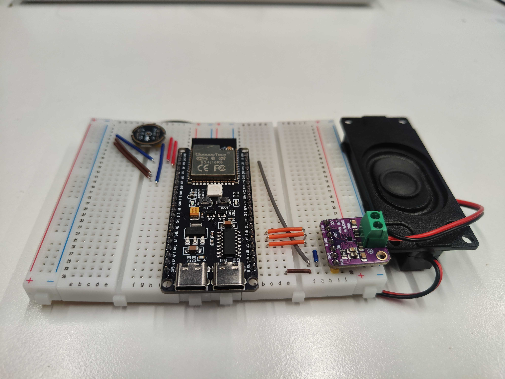
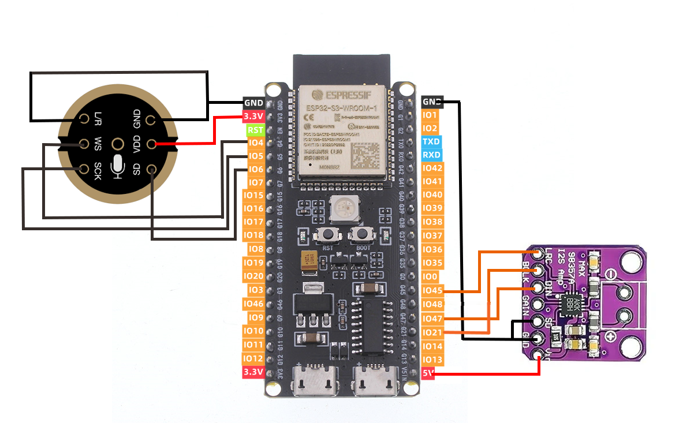
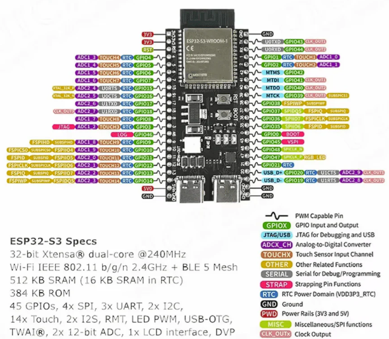

# АПК-СППР — Голосовой AI-ассистент для малого бизнеса

<p align="center">
  
</p>

<p align="center">
  
  
  
  
  
</p>

**АПК-СППР** — это голосовой помощник для склада и торговой точки. Сотрудник нажимает кнопку, задаёт вопрос голосом («Сколько осталось кофейных зерен?») и через 3–5 секунд получает ответ от AI через динамик. Никаких смартфонов — только кнопка и динамик.

**Архитектура:** гибридная. IoT-терминал (ESP32) изолирован от интернета и общается исключительно с локальным сервером по Wi-Fi. Сам сервер, запущенный на ПК в той же сети, обращается к облачным AI-сервисам (Whisper, GPT-4o-mini, Edge TTS) для распознавания речи, генерации ответа и синтеза голоса. Такой подход снижает требования к ресурсам устройства и упрощает замену AI-компонентов — достаточно поменять один вызов в `server.py`.

---

## Как это работает


---

## Стек технологий

| Слой                                 | Технология                                               |
| :--------------------------------------- | :----------------------------------------------------------------- |
| **Микроконтроллер** | ESP32-S3 (N16R8), Arduino IDE 3.x                                  |
| **Ввод звука**            | I2S-микрофон INMP441, PCM 8000 Гц / 16 бит / моно |
| **Вывод звука**          | I2S-усилитель MAX98357A + динамик                  |
| **Индикация**             | Адресный RGB-светодиод WS2812B (NeoPixel)         |
| **Бэкенд**                   | Python 3.10+, FastAPI, Uvicorn                                     |
| **STT**                            | OpenAI Whisper API                                                 |
| **LLM**                            | GPT-4o-mini (через ProxyAPI или напрямую)          |
| **TTS**                            | Microsoft Edge TTS (бесплатно, без лимитов)     |
| **База данных**          | SQLite                                                             |

---

## Аппаратная часть

<p align="center">
  
</p>

### Компоненты

* **ESP32-S3 (N16R8)** — центральный контроллер, Wi-Fi, 16 МБ Flash, 8 МБ PSRAM для буферизации аудио.
* **INMP441** — цифровой I2S-микрофон с шумоподавлением.
* **MAX98357A** — I2S-усилитель класса D со встроенным ЦАП.
* **WS2812B** — адресный RGB-светодиод состояний.
* **Кнопка Push-to-Talk** — физическая кнопка записи (GPIO 0 / BOOT).

### Индикация состояний

| Цвет                     | Состояние                                                  |
| :--------------------------- | :------------------------------------------------------------------ |
| 🔴**Красный**   | Идёт запись голоса                                  |
| 🔵**Синий**       | Передача данных / обработка сервером |
| 🟢**Зелёный**   | Воспроизведение ответа                         |
| ⚪**Выключен** | Ожидание нажатия кнопки                        |

### Распиновка (Pinout)

<p align="center">
  
</p>

> **Важно:** Светодиод WS2812B на платах ESP32-S3 аппаратно разведён на GPIO 48. Чтобы избежать конфликта шин I2S, контакты усилителя были переназначены:

* **MAX98357A:** `LRC` → GPIO 45, `DIN` → GPIO 47, `BCLK` → GPIO 21
* **INMP441:** `WS` → GPIO 4, `SD` → GPIO 6, `SCK` → GPIO 5
* **WS2812B:** GPIO 48
* **Кнопка:** GPIO 0

---

## Бэкенд (Сервер)

* **FastAPI** с асинхронной обработкой запросов.
* **RAG на SQLite**: перед каждым запросом к LLM сервер подставляет актуальные складские остатки из базы в системный промпт.
* **Автоочистка**: кэшированные MP3-файлы удаляются через 5 минут.
* **Веб-панель** доступна на `http://<IP>:8000/dashboard` — история диалогов и мониторинг устройства.
* **Облачные зависимости**: Whisper (STT), GPT-4o-mini (LLM), Edge TTS — заменяемы на локальные аналоги (Whisper.cpp, Ollama, Piper) без изменения логики сервера.

<p align="center">
  
</p>

---

## Результаты оптимизации

В ходе разработки проведено granular-профилирование с `time.perf_counter` на каждом этапе конвейера.

| Этап обработки                           | До оптимизации | После оптимизации |
| :---------------------------------------------------- | :-------------------------: | :-------------------------------: |
| **Распознавание Whisper STT**      |          ~1.50 с          |        **~0.90 с**        |
| **Поиск контекста в БД (RAG)** |          < 0.01 с          |        **< 0.01 с**        |
| **Рассуждение LLM (GPT-4o-mini)**    |          ~3.00 с          |        **~0.90 с**        |
| **Синтез речи (Edge TTS)**            |          ~8.90 с          |        **~1.70 с**        |
| **Общая задержка (RTT)**           |     **18.36 с**     |     **3.20 – 5.50 с**     |

### Ключевые меры оптимизации

1. **Отключение Wi-Fi Power Save** — директива `esp_wifi_set_ps(WIFI_PS_NONE)` в прошивке ESP32 убирает задержки пакетов.
2. **Промпт-инжиниринг** — жёсткие системные инструкции: максимум 2 предложения, `max_tokens=60`. Экономия на времени генерации.
3. **Ускорение Edge TTS** — параметр `rate="+20%"` сокращает время синтеза и делает речь более естественной.

---

## Быстрый старт

### 1. Сервер (Python)

```bash
# Клонировать репозиторий
git clone https://github.com/your-username/APK-SPPR.git
cd APK-SPPR

# Создать и активировать виртуальное окружение
python -m venv ai_env
# Windows:
ai_env\Scripts\activate
# Linux / macOS:
source ai_env/bin/activate

# Установить зависимости
pip install -r requirements.txt
```

Отредактировать блок **КОНФИГУРАЦИЯ** в начале `server.py`:

```python
OPENAI_API_KEY = "YOUR_API_KEY_HERE"   # ← вставить свой ключ
LOCAL_IP = "192.168.1.100"             # ← IP этого компьютера в локальной сети
```

```bash
# Запустить сервер
python server.py
```

Сервер будет доступен на `http://localhost:8000`.
Веб-панель: `http://localhost:8000/dashboard`.

### 2. Прошивка ESP32 (Arduino IDE)

1. Установите поддержку плат **ESP32** версии 3.x через Boards Manager.
2. Установите библиотеки через Library Manager:
   * **ArduinoJson** — разбор JSON-ответа сервера.
   * **Adafruit NeoPixel** — управление RGB-светодиодом.
   * Аудиобиблиотеки из папки `src/` скопируйте в директорию `libraries` Arduino IDE.
3. Откройте `examples/chat_local/chat_local.ino`.
4. Укажите параметры сети:
   ```cpp
   const char *ssid       = "Ваш_WiFi";
   const char *password   = "Пароль_WiFi";
   const char *SERVER_IP  = "IP_Сервера";  // тот же, что LOCAL_IP в server.py
   const int   SERVER_PORT = 8000;
   ```
5. Выберите плату `ESP32S3 Dev Module`, загрузите прошивку.

---

## Структура репозитория

```
APK-SPPR/
├── server.py              # FastAPI-сервер (STT → RAG → LLM → TTS)
├── extract.py             # Утилита извлечения данных
├── requirements.txt       # Python-зависимости
├── img/                   # Фото прототипа и схемы подключения
├── src/                   # Библиотеки I2S-аудио для ESP32
│   ├── Audio.h / Audio.cpp
│   ├── I2SAudioPlayer.h / .cpp
│   └── *_decoder/         # Декодеры AAC, FLAC, MP3, Opus, Vorbis
└── examples/
    └── chat_local/
        └── chat_local.ino # Скетч голосового терминала
```

---

## Перспективы развития

* **Captive Portal (WiFiManager)** — настройка Wi-Fi без перепрошивки.
* **OTA-обновления** — обновление прошивки по воздуху.
* **Полный офлайн-режим** — замена облачных API на локальные модели (Whisper Local + Ollama + Piper TTS).
* **Расширение базы данных** — аналитика продаж, учёт поставок, уведомления о критических остатках.
